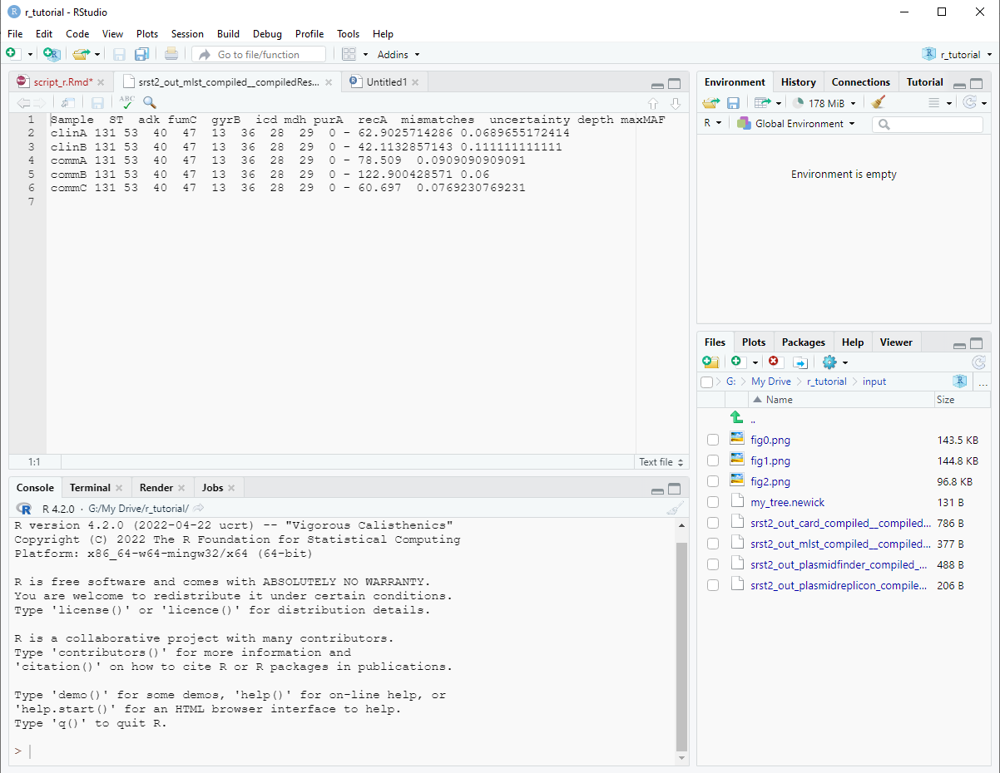

```{r setup, include=FALSE}
knitr::opts_chunk$set(echo = TRUE)
```

## Overview

In our [previous](https://jdwiyanto.github.io/wgs_tutorial1_bash/) session, we used Ubuntu to process WGS files and gained several outputs from biomarker screenings. In this guide, we will explore how to work with these files and convert them to a publication-ready figures and tables.

## Working with R and RStudio

Unlike the previous session where we utilised Ubuntu Bash language to power our bioinformatics processes, this session uses R, a statistical programming language. The vocabularies and sentence structure are slightly different, although both shared some common features. 

You can install R in your computer [here](https://cran.r-project.org/mirrors.html).

RStudio is an integrated development environment (IDE), which is a program from where we can easily code and interact with R. The default RStudio appearance consists of four panels:

{width=800px}

Where:

* 1. Panel to write our script and codes
* 2. Panel to view our R variables and environment
* 3. Panel to view our script output
* 4. Panel to view our Windows directory

You can install RStudio Desktop [here](https://posit.co/download/rstudio-desktop/).

## Accessing your working directory

Go to my github page to download the "input" folder and the "r_tutorial.Rproj" file [here](https://github.com/jdwiyanto/wgs_pangenome/tree/main/r_tutorial_github). Make sure the "input" folder and the Rproj file is placed in the same path. Double-click on the "r_tutorial.Rproj" file. This will launch RStudio, where we can start working on our WGS output files.

## Creating a new R script 

Let's start off by creating a new R script. We can do this by pressing on the green plus icon on the top left corner of the screen, just below "File", or alternatively we can use the keyboard shortcut of CTRL+SHIFT+N. After you've done this step, you should see a new blank script appearing in your panel 1.

{width=800px}

This blank script will be where we shall write our codes. 

## Working with R

R is essentially an advanced calculator, where you can perform various operations, from basic calculations (e.g., 1+1), to statistical modelling (e.g., regression modelling). 

Besides this, you can also use R to view tables and sheets, modify them, produce figures, and many more. You can think of R as a code-based Excel sheets, or Google sheets.

We will be working under the [tidyverse](https://www.tidyverse.org) environment, which is a collection of functions we can run in R which is more user-friendly and intuitive compared to the conventional R. We will load the tidyverse by typing the following command in your R script, followed by a CTRL+ENTER.

```{r}
if (!require("tidyverse", quietly = TRUE))
    install.packages("tidyverse")
library(tidyverse)
```

### Using R as a calculator

Let's try some example. Type `1+1` in your script, then press CTRL+ENTER. You will see the result in Panel 3. 

You can do multiplication by using the asterisk `*` symbol. For example `3*3`.

Division is done with the slash `/` symbol. For example `9/3`

Power is done with the `^` symbol. For example `3^2`

{width=800px}

### Assigning variables in R

Variable is an integral part of R that we will encounter frequently in our tutorial. A variable will store whatever syntax that you have provided, which you can later call out. You can assign a syntax into a variable by using the following format: "\<variable\> <- \<syntax\>". For example, we can assign the number "1" to the variable "a":

```{r}
a <- 1
```

You will see a new variable called `a` in Panel 2. Now, we can run our mathematical operations by invoking this variable. For example:

```{r}
a+3
```
You can reassign variable anytime, and it will overwrite the existing value. For example:

```{r}
a
a <- 3
a
```

You can remove a variable from the environment by using the `rm` function:

```{r}
rm(a)
```

Which will remove the `a` variable from your Environment (i.e., Panel 2).

**Quiz**: Assign the value 345 to variable 'x' and 123 to variable 'y'. What is the output of ((x*y)+x)/y?

```{r}
x <- 345
y <- 123

((x*y)+x)/y
```

### Opening files in R

We can also use R to view files and sheets from Windows. Still remember the compiled MLST text file that we created using SRST2? I have copied the file into the folder "input", which you can access from the lower-right window of RStudio.

{width=800px}

The MLST output from SRST is named "srst2_out_mlst_compiled__compiledResults.txt". If you click on it, it will open in a new tab within Panel 1.

{width=800px}

To import the files into R, we can use the function `read.delim`. For example:

```{r}
read.delim(file = 'input/srst2_out_mlst_compiled__compiledResults.txt')
```

We can then assign this file to a new variable in R by typing the following:

```{r}
mlst <- read.delim(file = 'input/srst2_out_mlst_compiled__compiledResults.txt')
```

{width=800px}

Now, you can call out the MLST table anytime by just typing `mlst`. Try it out:

```{r}
mlst
```

This type of data table in R is also known as a data frame. You can think of a data frame as something you will find when you open an Excel file, which has rows and columns you can modify. The good news is, working with data frame in R gives you much more flexibility in terms of data transformation and visualisation than if you only use Excel. I will elaborate more on this below.

## Transforming data in R
R is a powerful tool to transform and reshape our data. There are millions of tools that you can use, but I will highlight some commonly used functions below:

### Converting between column and rownames
Sometimes you need to assign rownames to your data frame and vice versa, removing rownames into a column of your data frame. You can use the function `rownames_to_column` or `column_to_rownames` to achieve this.

```{r}
mlst
mlst %>% column_to_rownames('Sample')
mlst %>% column_to_rownames('Sample') %>% rownames_to_column('ID')
```

### Creating a new column in your data frame
You can create a new column in your data frame through the `mutate` function. You can even assign the values for the new column from the existing values that we have. 

```{r}
mlst

mlst %>% 
  mutate(newcolumn = 'values_for_new_column')

mlst %>%
  mutate(newcolumn = 9)

mlst %>%
  mutate(recA_added = recA+100)

mlst %>%
  mutate(sample_setting = str_extract(string=Sample, pattern = 'clin|comm'))

mlst %>%
  mutate(Sample = ifelse(Sample == 'clinA', 'clinicalA', Sample))
```

### Renaming column names
You can rename your column names using the function `rename` and its derivatives.

```{r}
mlst %>%
  rename(ID = Sample)

mlst %>%
  rename_all(.funs = ~paste0('extra_', .))

mlst %>%
  rename_if(is.integer, ~paste0('integer_', .))
```

### Selecting specific columns
You can choose to only keep certain columns in R using the function `select`

```{r}
mlst

mlst %>% 
  select(Sample, ST, adk)
```

### Pivoting a data frame 
You can pivot a data frame using the function `pivot_table`

```{r}
mlst

mlst %>% 
  select(Sample, ST, adk) %>%
  pivot_longer(!Sample, 
               names_to = 'name', 
               values_to = 'value')
```
### Pipe, or %>%

If you haven't already noticed, we used a lot of the `%>%` symbol in our codes. This symbol is referred to as the pipe, which is basically a bridge between your previous and the next codes.

**Quiz**: We can save table from R into a csv files, which we can open using Excel, using the function `write.csv`. Try saving the mlst table into a csv file named 'mlst_table.csv'. 

```{r eval=F}
write.csv(x = mlst,
          file = 'mlst_table.csv',
          quote=F)
```

**Quiz**: Now that you know how to load files and assign them into variables, try loading the remaining SRST2 output into R. There are three files:

* srst2_out_card_compiled__compiledResults.txt into the R variable `card`
* srst2_out_plasmidfinder_compiled__compiledResults.txt into the R variable `plasmidfinder`
* srst2_out_plasmidreplicon_compiled__compiledResults.txt into the R variable `plasmidreplicon`

```{r}
card <- read.delim(file = 'input/srst2_out_card_compiled__compiledResults.txt')
plasmidfinder <- read.delim(file = 'input/srst2_out_plasmidfinder_compiled__compiledResults.txt')
plasmidreplicon <- read.delim(file = 'input/srst2_out_plasmidreplicon_compiled__compiledResults.txt')
```

## Visualising WGS screening output 

Now let's combine all the above information to see an example of how we could transform a raw output into a publication-ready figure.

```{r}
# card
card2 <- 
  card %>%
  column_to_rownames('Sample') %>%
  mutate(across(.fns = ~ifelse(.=='-', 0, 1))) %>%
  rename_all(~paste0('card_', .)) %>%
  rownames_to_column('ID')

fig.card <- 
  card2 %>%
  pivot_longer(!ID) %>%
  ggplot(aes(x=name, y=ID, fill=as.factor(value))) +
  geom_tile() +
  labs(x='Resistance Genes',
       y='Sample ID',
       title = 'Resistance genes carriage of ST131 isolates') +
  theme(axis.text.x = element_text(angle=45, hjust=1)) +
  scale_fill_discrete(name='Presence', labels = c('Absent', 'Present')) 

fig.card

# plasmidfinder
plasmidfinder2 <- 
  plasmidfinder %>%
  column_to_rownames('Sample') %>%
  mutate(across(.fns = ~ifelse(.=='-', 0, 1))) %>%
  rename_all(~paste0('finder_', .)) %>%
  rownames_to_column('ID')

fig.finder <- 
  plasmidfinder2 %>%
  pivot_longer(!ID) %>%
  ggplot(aes(x=name, y=ID, fill=as.factor(value))) +
  geom_tile() +
  labs(x='Resistance Genes',
       y='Sample ID',
       title = 'PlasmidFinder carriage of ST131 isolates') +
  theme(axis.text.x = element_text(angle=45, hjust=1)) +
  scale_fill_discrete(name='Presence', labels = c('Absent', 'Present')) 

fig.finder

# plasmidreplicon
plasmidreplicon2 <- 
  plasmidreplicon %>%
  column_to_rownames('Sample') %>%
  mutate(across(.fns = ~ifelse(.=='-', 0, 1))) %>%
  rename_all(~paste0('replicon_', .)) %>%
  rownames_to_column('ID')

fig.replicon <- 
  plasmidreplicon2 %>%
  pivot_longer(!ID) %>%
  ggplot(aes(x=name, y=ID, fill=as.factor(value))) +
  geom_tile() +
  labs(x='Resistance Genes',
       y='Sample ID',
       title = 'Plasmid replicon carriage of ST131 isolates') +
  theme(axis.text.x = element_text(angle=45, hjust=1)) +
  scale_fill_discrete(name='Presence', labels = c('Absent', 'Present')) 

fig.replicon
```

We can combine the figures in several ways:

```{r}
if (!require("ggpubr", quietly = TRUE))
    install.packages("ggpubr")

library(ggpubr)

fig.compiled <- 
  ggarrange(fig.card, fig.finder, fig.replicon,
            ncol=1,
            common.legend = T)
```

{width=800px}

**Quiz**: We can save figures using the `ggsave` function. Save the above figure into a file named 'fig_compiled.png'.

```{r eval=F}
ggsave(filename = 'fig_compiled.png', 
       plot = fig.compiled,
       height=9, width=9)
```

```{r}
# the longer but tidier way
fig.compiled2 <- 
  plyr::join_all(dfs = list(card2, plasmidreplicon2, plasmidfinder2), by='ID') %>%
  pivot_longer(!ID) %>%
  mutate(group = str_extract(string = name,
                             pattern = 'card|replicon|finder')) %>%
  ggplot(aes(y=name, x=ID, fill=as.factor(value))) +
  geom_tile() +
  facet_wrap(~group, 
             scales='free') +
  scale_fill_manual(name='Presence', 
                    labels = c('Absent', 'Present'),
                    values = c('grey', 'dodgerblue')) +
  labs(x='Features', y='ID') +
  theme(axis.text.x = element_text(angle=45, hjust=1),
        strip.text.x = element_text(face='bold'))
```


**Quiz**: Save the above figures into a file named 'fig_compiled2.png'

```{r eval=F}
ggsave(filename='fig_compiled2.png',
       plot = fig.compiled2,
       height=7,
       width=9)
```

## Concluding remarks

Now you have learned some basic operations in R, including importing output data from WGS pipeline and transforming them into figures for reporting and publication purposes. As you may have noticed, getting familiar with computer languages require lots and lots of trials and errors before you get the right result. However, I promise you that the time spent will be worth the effort in the long run.

Keep scripting!

